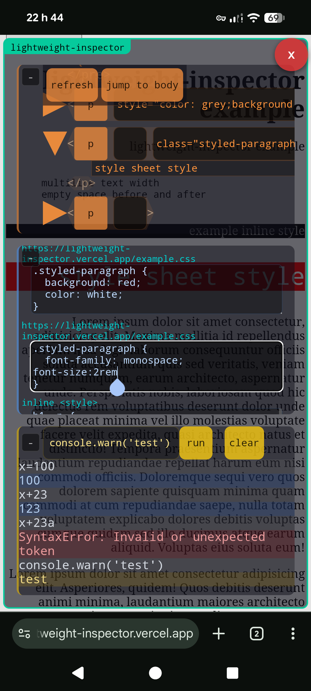

# lightweight-inspector [](https://github.com/hchiam/lightweight-inspector/releases)

Just one of the things I'm working on. <https://github.com/hchiam/learning>

## 2 goals

1) enable minimally inspecting only a few things in js/css/html in a browser on a mobile device, and

2) make it easier to trust by making it easier to find and read [the whole code on GitHub](https://github.com/hchiam/lightweight-inspector/blob/main/script.js). (no deps)

<p align="center"></p>

## script.js code

<https://github.com/hchiam/lightweight-inspector/blob/main/script.js>

## [bookmarklet](https://github.com/hchiam/learning-js/tree/main/bookmarklets#bookmarklets) to run the [script.js](https://github.com/hchiam/lightweight-inspector/blob/main/script.js)

_**MAKE SURE YOU UNDERSTAND THE CODE IN
[script.js](https://github.com/hchiam/lightweight-inspector/blob/main/script.js)
BEFORE YOU USE THIS OR ANY BOOKMARKLET CLAIMING TO USE IT!**_

### bookmarklet to automatically use the latest [version](https://github.com/hchiam/lightweight-inspector/releases)

<details>
<summary>(click to expand)</summary>

```js
javascript:(()=>{
    fetch('https://api.github.com/repos/hchiam/lightweight-inspector/releases/latest')
        .then(x=>x.json())
        .then(x=>{
            const src = `https://raw.githubusercontent.com/hchiam/lightweight-inspector/${x.tag_name}/script.js`;
            try {
                if (!document.addedLightweightInspectorSecuritypolicyviolationEventListener) {
                    document.addedLightweightInspectorSecuritypolicyviolationEventListener = true;
                    document.addEventListener('securitypolicyviolation', (e) => {
                        alert(`CSP blocking lightweight-inspector`);
                    });
                }
                fetch(src).then(x=>x.text()).then(x=>{eval(x);});
            } catch(e) {
                try {
                    const script = document.createElement('script');
                    script.src = src;
                    document.body.append(script);
                } catch(e) {
                    alert(`couldn't start lightweight-inspector`);
                }
            }
        });
})();
```

</details>

### bookmarklet example locked to [version](https://github.com/hchiam/lightweight-inspector/releases) **0.5.1**

to avoid automatic updates:

<details>
<summary>(click to expand)</summary>

```js
javascript:(()=>{
    const src = 'https://raw.githubusercontent.com/hchiam/lightweight-inspector/0.5.1/script.js';
    try {
        if (!document.addedLightweightInspectorSecuritypolicyviolationEventListener) {
            document.addedLightweightInspectorSecuritypolicyviolationEventListener = true;
            document.addEventListener('securitypolicyviolation', (e) => {
                alert(`CSP blocking lightweight-inspector`);
            });
        }
        fetch(src).then(x=>x.text()).then(x=>{eval(x);});
    } catch(e) {
        try {
            const script = document.createElement('script');
            script.src = src;
            document.body.append(script);
        } catch(e) {
            alert(`couldn't start lightweight-inspector`);
        }
    }
})();
```

</details>

## with [console-log-element](https://github.com/hchiam/console-log-element)

Firefox _on mobile_ seems to make it a little harder to run bookmarklets from your saved bookmarks. if you're using [console-log-element](https://github.com/hchiam/console-log-element) to run the above [bookmarklet](https://github.com/hchiam/learning-js/tree/main/bookmarklets#bookmarklets) in Firefox _on mobile_, here's a helpful code snippet to hide it when you don't need it anymore:

```js
$('#firefox-extension-console-log-element')?.remove();$('#script_firefox-extension-console-log-element')?.remove();
```

## local development

<details>

<summary>local development notes</summary>

(using [`bun`](https://github.com/hchiam/learning-bun))

this will automatically run <http://localhost:3000>:

```sh
bun dev
```

(Howard currently has <https://lightweight-inspector.vercel.app> automatically updated upon commit.)

and for Howard to deploy to <https://lightweight-inspector.surge.sh/> and/or <https://lightweight-inspector.vercel.app> run this:

```sh
bun run deploy
```

if `bun run deploy` seems to have difficulty deploying to vercel via CLI, then a deploy webhook can instead be set up (to avoid having to change the github noreply email used in commits): <https://stackoverflow.com/questions/79011901/error-vercel-git-author-must-have-access-to-the-project-on-vercel-to-create-d> (and then `bun run deploy` is no longer necessary)

</details>
